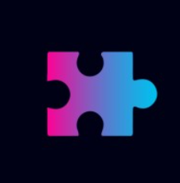

<h1 style="font-weight: bold; text-align:center;"> s21-03-m-webapp | placeholder</h1>

  

 

---

## Descripción del Proyecto 🚀

Sistema de Gestión para Meseros (POS para Restaurantes).

### 1️⃣ Introducción

En la industria gastronómica, la eficiencia en la gestión de pedidos y atención al cliente es fundamental para brindar una experiencia de calidad. Un Sistema de Gestión para Meseros (POS para Restaurantes) permite digitalizar y optimizar el proceso de toma de pedidos, coordinación con la cocina, gestión de pagos e inventario, mejorando la productividad y reduciendo errores operativos.

### 2️⃣  Objetivo del Proyecto

El objetivo de este proyecto es desarrollar un sistema digital que facilite la gestión de pedidos, mesas y facturación en restaurantes, cafeterías y bares. La solución debe ser intuitiva, rápida y adaptable a diferentes tipos de establecimientos gastronómicos.

### 3️⃣ Funcionalidades Clave

 * **Gestión de Pedidos y Comandas**:
Toma de pedidos mediante una interfaz digital desde una tablet o móvil.
Envío automático de órdenes a la cocina y bar.
Modificación y cancelación de pedidos en tiempo real.
Estados de pedidos: "En preparación", "Listo", "Entregado".

 * **Gestión de Mesas**:
Visualización en tiempo real del estado de las mesas (ocupadas, libres, reservadas).
Asignación de clientes a mesas y control de ocupación.
División y unificación de cuentas por mesa.

 * **Facturación y Pagos**:
Generación de tickets digitales o impresos.
Métodos de pago múltiples: efectivo, tarjeta, QR.
División de cuentas entre varios clientes.
Propinas opcionales en pagos digitales.

 * **Control de Inventario**:
Registro y control de productos e ingredientes.
Notificaciones automáticas por bajo stock.
Integración con la venta para ajustar el inventario en tiempo real.

 * **Gestión del Personal**:
Control de turnos y asistencia de meseros.
Registro de desempeño basado en ventas y atención.
Roles y permisos diferenciados (administrador, mesero, cajero, etc.).
 * **Reportes y Estadísticas**:
Análisis de ventas diarias, semanales y mensuales.
Identificación de los productos más vendidos.
Reportes de productividad del personal.
Detección de horarios de mayor afluencia.

### 4️⃣ Público Objetivo
Este sistema está dirigido a restaurantes, cafeterías, bares y food trucks que buscan digitalizar y optimizar sus operaciones, reduciendo el tiempo de espera y mejorando la atención al cliente.

 

---

## Miembros del equipo 👥 {#members}

<table align="center">
  <thead>
    Equipo / contacto 
  </thead>
  <tr>
    <th>Rol</th>
    <th>Nombre</th>
    <th>Contacto</th>
    <th>Github/+</th>
    <th>Avatar gh</th>
  </tr>
<!--
  <tr>
    <td> 👔 Team Leader</td>
    <td>Fernando Vergel TL</td>
    <td><a href="https://www.linkedin.com/in/fernandovergel/" target="_blank">/fernandovergel/</a> </td>
    <td>-</td>
    <a href="https://www.linkedin.com/in/andresseguradev/" target="_blank">/andresseguradev/</a> 
    <td>-</td>
  </tr>
-->
  <tr>
    <td>📜 Manager </td>
    <td>Andrés Segura</td>
    <td>
      
    </td>
        <td><a href="https://github.com/Andr7st" target="_blank">Andr7st</a> </td>
    <td> </td>
  </tr>
  <!--
  <tr>
    <td>📊 UX/UI</td>
    <td>Malena Jara</td>
    <td>
      
    </td>
    <td><a href="https://github.com/Malena646" target="_blank">Malena646</a> </td>
    <td> </td>
  </tr> 
  -->
  <tr>
    <td>🧪 Tests</td>
    <td>Pía Crosa</td>
    <td></td>
    <td><a href="https://github.com/PiaCrosa/" target="_blank">PiaCrosa</a> </td>
    <td> </td>
  </tr>
  <tr>
    <td>⚙️ Backend</td>
    <td>Alejandro Verduguez</td>
        <td>
      
    </td>
    <td><a href="https://github.com/alelex10/" target="_blank">alelex10</a> </td>
    <td> </td>
  </tr>
  <tr>
    <td>🔄 Full Stack</td>
    <td>Tomás Ballesty</td>
    <td>
      
    </td>
    <td><a href="https://github.com/Tolomatico" target="_blank">Tolomatico</a> </td>
    <td> </td>
  </tr>
  <tr>
    <td>🔄 Full Stack</td>
    <td>Tomas Padilla</td>
    <td>
      
    </td>
    <td><a href="https://github.com/PadillaTom" target="_blank">PadillaTom</a> </td>
    <td> </td>
  </tr>
  <tr>
    <td>🎨 Frontend</td>
    <td>Alan Zurita</td>
        <td>
      
    </td>
    <td><a href="https://github.com/AlanProgrammer93" target="_blank">AlanProgrammer93</a> </td>
    <td> </td>
  </tr>

  <tr>
    <td>🎨 Front End</td>
    <td>Tomás Villegas</td>
    <td>
      
    </td>
    <td><a href="https://github.com/Tomas213-V" target="_blank">Tomas213-V</a> </td>
    <td> </td>
  </tr>
</table>
 

---

## Tecnologías 🛠️ {#stack}

Nuestro proyecto, con el nombre clave **s21-03-m-webapp** está abstraido en los siguientes proyectos listados a continuación.

### - 🛠️ Base de datos {#data}

La base de datos la administramos mediante el **ORM** que se usa en el proyecto backend, pero también usamos el administrador de conexiones mediante la terminal de comandos para hacer las practicas.

  
  

`#mongoDb`,`#mongoose`

### - 🛠️ Back End {#back}

Este proyecto usa las tecnologías **nodejs**, **express** con los modulos de **Data**,  **Security** y **Cloud**; entre otros.

  
  
  

`#express`,`#openApi`,`#nodejs`,

### - 🛠️ Front End {#front}

Este proyecto usa las tecnologías... **react**, **nextjs**, **typescript** y **tailwind css**.

Las estrategias y herramientas que se usaron al momento de hacer las pruebas.

  
  
  

`#react`, `#nextjs`, `#typescript`

 

---

## Pruevas: 🧪 {#tests}

Información sobre cómo ejecutar pruebas automatizadas, casos de prueba o procedimientos de validación.

<!--
### - 🧪 Flujo continuo {#project-integration}

Pruevas de automatizadas del repositorio.

  
  
  

`ci/cd`, `git-flow`, `workflow-actions`. 
-->

### - 🧪 Usabilidad {#user-stories}

Pruevas para garantizar que los usuarios tengan una buena experiencia.

  
  
  

`#postman`, `#swagger`, `#dev-tools`, `#visual-studio-code`.

 

---

## Agradecimientos 🎉 {#acknowledgements}

Agradecimientos a [**No Country**](https://github.com/No-Country-simulation) por organizar este espacio para adquirir más experiencia laboral.

  

 

---
